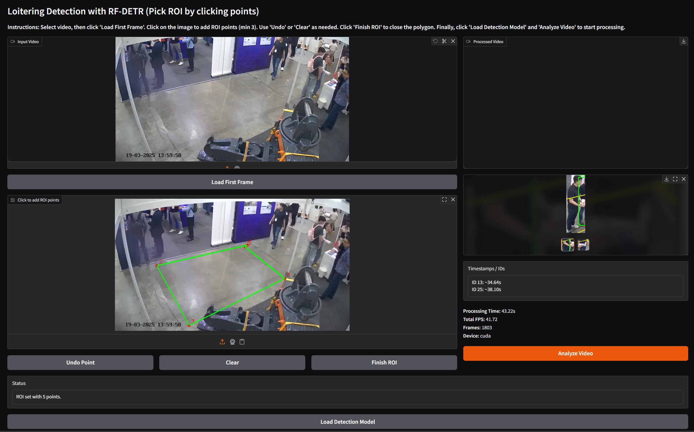
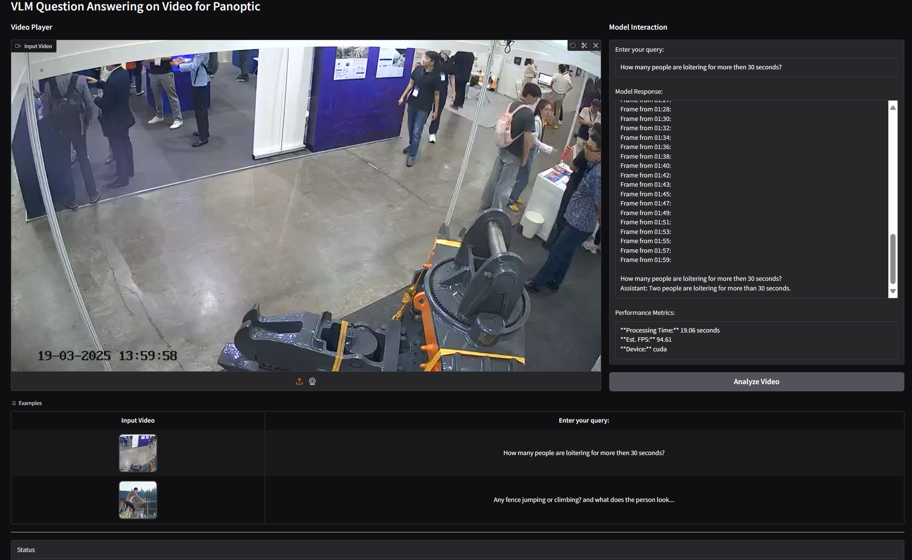

# Computer vision for public spaces

## Overview

Singapore has a vast network of surveillance cameras, but manually reviewing the extensive video data for actionable insights is time-consuming and inefficient. This project presents two distinct computer vision (CV) approaches to automate video analysis, providing valuable analytics for public safety and urban management. I will look at loitering in public spaces and whether CV models can capture that. Due to lack of concrete data, I will use a CCTV video as proxy and draw a region of interest, defining loitering as a person in the ROI for > 30 sec.

## Suggested environment

I would highly recommend using conda env to run this compared to using docker

```bash
conda create -n env python=3.10
conda activate env
pip install -r requirements.txt
```

## Approach 1: Loitering Detection with RF-DETR and Rule-Based Logic (Lower Compute, Rule-based)

This application is a lightweight solution designed for systems with limited computational resources. It uses a combination of object detection and tracking to identify and quantify loitering behavior. This is stored in ```/edge``` folder.



### How It Works

Human Detection: The app uses RF-DETR, an object detection model, to identify all individuals (i.e., "persons") in a video frame.

Tracking: ByteTrack, a state-of-the-art tracking algorithm, assigns a unique ID to each person and follows them across frames.

Region of Interest (ROI): A user-friendly Gradio interface allows users to define a custom polygon-based ROI by clicking points on the first frame of a video.

Rule-Based Analysis: The application tracks the "dwell time" of each individual as they remain within the defined ROI. If an individual's dwell time exceeds a predefined threshold (e.g., 30 seconds), they are flagged for loitering. This is based on the bottom center of the bbox being in the ROI polygon.

Output: The application generates an annotated video with bounding boxes and dwell times, a gallery of cropped images of flagged individuals, and a list of their timestamps

### How to use

if using conda and activated
```bash
python edge/test.py
```
for direct processing

or 
```bash
python edge/test2.py
```
for Gradio interface


## Approach 2: Video Question-Answering with Visual Language Model (Higher Compute, VLM)

This application uses a powerful Visual Language Model (VLM) to understand and answer complex queries about video content. It offers a more versatile approach that provides a deeper analysis of surveillance footage. This is stored in ```/cloud``` folder.



### How It Works

VLM Integration: The application uses the SmolVLM2-500M-Video-Instruct model, which can process both video and text inputs simultaneously.

Natural Language Queries: Users can ask specific questions in plain language, such as "How many people are loitering for more than 30 seconds?" or "What is the person in the red shirt doing?".

Video-Text Synthesis: The VLM analyzes the entire video stream in conjunction with the user's query to generate a coherent and relevant text-based response.

High-Level Insight: This method offers greater flexibility than the rule-based approach, as it can respond to a wide range of queries, including descriptive questions that are difficult to program with fixed rules.

### Instructions

In root folder run:

```bash
python cloud/app.py
```

For Gradio interface

## Streaming


For task 3, we simulate streaming by using webcam and calling a fastapi backend. The task here is to count number of times people go from L -> R and R -> L and hopefully this works in close to real time.

```bash
uvicorn cloud.api:app --host 0.0.0.0 --port 8000 --reload  
```

and

```bash
python streaming/webcam.py
```

## Results 

Results of loitering are stored in ```/results```. We clearly can detect 2 people loitering >30 secs.

Hardware and performance are stored in  ```monitoring```

Docker: Can run in root project using ```docker build -t edge -f cloud/Dockerfile.edge .``` but might be wonky due to GPU?

## Thoughts

Interesting take home assignment on use of CV for loitering in public spaces. Used RF-DETR as base model due to fast and open source unlike YOLO model which has licensing issues. For edge, we used simple rule-based heuristics to give use good enough approximation metrics, but we can clearly see that it suffers from typical CV issues like occlusion, tracking and cannot do action recoginition. We can still identify potential loiterers and extract their images and search for them. It was also a pity that I could quantise the model to potentially improve runtime but due to my system conflict, I could not get the ONNXruntime-gpu installation right or else we can definitely see a much faster inference time. My quantised onnx is in ```/models```.

For VLM, due to resource constraints, I used [smolVLM](https://huggingface.co/HuggingFaceTB/SmolVLM2-500M-Video-Instruct) which might not be the best but is a good enough VLM with video reasoning capabilities. How I would improve this is to use a larger VLM and another one with gorunding capabilities so for example, we can use [HunYuan](https://huggingface.co/TencentARC/ARC-Hunyuan-Video-7B) to get video reasoning and identify which timestamps have certain actions of interest and then use [GroundingDINO](https://huggingface.co/IDEA-Research/grounding-dino-base) or [RexThinker](https://huggingface.co/IDEA-Research/Rex-Thinker-GRPO-7B) to extract the image or the person. Or we can be lazy and try to use LlaVa or [VJepa](https://ai.meta.com/vjepa/) tho VJepa2 mainly does whole video classification.


